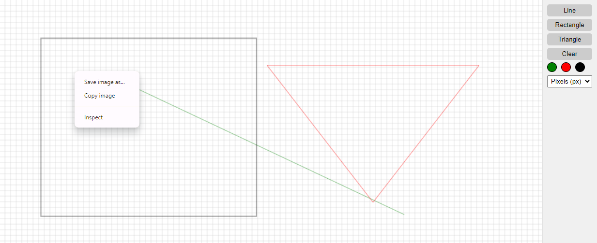

# Canvas Drawing App

This is a simple web-based canvas drawing application that allows users to draw shapes, select, copy, paste, cut, undo, and save their drawings as images or PDFs.

## Features

- Draw lines, rectangles, and triangles on the canvas.
- Select drawing color from a range of options.
- Clear the canvas to start fresh.
- Undo the last drawing action.
- Select all shapes on the canvas.
- Copy selected shapes to the clipboard.
- Paste copied shapes onto the canvas.
- Cut selected shapes from the canvas.
- Save the canvas drawing as an image (PNG).
- Save the canvas drawing as a PDF with customizable options.

## Usage

1. Choose a drawing tool from the toolbar (line, rectangle, triangle).
2. Select a color from the color palette.
3. Click and drag on the canvas to draw shapes.
4. Use shortcuts like Ctrl+S (save), Ctrl+Z (undo), Ctrl+A (select all), Ctrl+C (copy), Ctrl+V (paste), Ctrl+X (cut).
5. Click the "Download" button to save the canvas as an image.

## Installation

1. Clone this repository to your local machine.
2. Open the `index.html` file in your web browser.
3. Start drawing on the canvas!

# Interface: 

